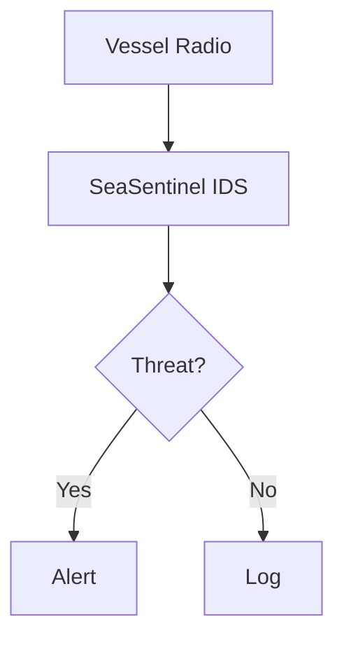

# SeaSentinel Documentation Site - Deployment Guide

## Quick Start

The SeaSentinel documentation site is built with Astro and ready to deploy to GitHub Pages.

### Prerequisites
- GitHub repository: `cywf/SeaSentinel`
- Node.js 20 LTS
- GitHub Actions enabled

### Deployment Steps

1. **Enable GitHub Pages**
   - Navigate to: https://github.com/cywf/SeaSentinel/settings/pages
   - Under "Build and deployment" → "Source"
   - Select: **GitHub Actions**

2. **Merge the PR**
   - Merge the documentation site PR to the `main` branch
   - GitHub Actions will automatically trigger

3. **Monitor Deployment**
   - Go to: https://github.com/cywf/SeaSentinel/actions
   - Watch the "Deploy to GitHub Pages" workflow
   - Build typically takes 2-3 minutes

4. **Access the Site**
   - Once deployed, visit: https://cywf.github.io/SeaSentinel/
   - All routes use the base path `/SeaSentinel`

## Local Development

### Initial Setup
```bash
cd site
npm install
```

### Development Server
```bash
npm run dev
# Opens at http://localhost:4321/SeaSentinel
```

### Production Build
```bash
npm run build
# Output in site/dist/
```

### Preview Production Build
```bash
npm run preview
# Opens at http://localhost:4321/SeaSentinel
```

### Type Checking
```bash
npm run typecheck
```

## Site Structure

### Pages (9 total)
- `/` - Homepage with project overview
- `/rulebook` - Detection rules, signatures, and playbooks
- `/statistics` - Repository metrics and charts
- `/discussions` - Community discussions
- `/development-board` - Project board and issues
- `/create-issue` - Quick issue creation links
- `/docs` - Documentation and GMDSS primer
- `/visualizer` - Mermaid diagram viewer
- `/404` - 404 error page

### Data Sources

The site uses two types of data:

1. **CI-Generated Indexes** (at build time)
   - `public/rulebook/rules.json` - From `rules/` directory
   - `public/rulebook/signatures.json` - From `signatures/` directory
   - `public/rulebook/playbooks.json` - From `playbooks/` directory
   - `public/diagrams/diagrams.json` - From `mermaid/` directory

2. **GitHub API Snapshots** (at build time)
   - `public/data/stats.json` - Repository statistics
   - `public/data/discussions.json` - Latest discussions
   - `public/data/projects.json` - Project board data

## Adding Content

### Rules
Create YAML or JSON files in `rules/` directory:
```yaml
# rules/dsc_unauthorized.yml
id: dsc-unauthorized-distress
name: Unauthorized DSC Distress Alert
severity: critical
protocol: DSC
description: Detects DSC distress calls from unknown or blacklisted MMSIs
match:
  category: distress
  format: geographic-area
```

### Signatures
Create YAML or JSON files in `signatures/` directory:
```yaml
# signatures/dsc_patterns.yml
id: dsc-distress-pattern
name: DSC Distress Signal Pattern
protocol: DSC
description: Pattern matching for DSC distress signals
fields:
  - format_specifier
  - category
  - position
  - mmsi
```

### Playbooks
Create Markdown files in `playbooks/` directory:
```markdown
# playbooks/isolation_procedure.md
---
title: Vessel Isolation Procedure
tags: [Isolation, Response, Critical]
---

## Overview
Procedure for isolating a potentially compromised vessel...
```

### Mermaid Diagrams
Create `.mmd` files in `mermaid/` directory:


## Themes

The site includes 7 dark-first themes:
1. **Nightfall** (default)
2. Dracula
3. Cyberpunk
4. Dark Neon
5. Hackerman
6. Gamecore
7. Neon Accent

Users can switch themes using the theme selector in the navbar. The selection persists in localStorage.

## Environment Variables

Set in `.env` or CI environment:
```bash
PUBLIC_DEFAULT_THEME=nightfall
PUBLIC_COMMIT_SHA=<commit_sha>
PUBLIC_DEPLOY_TIMESTAMP=<timestamp>
```

These are automatically injected by the GitHub Actions workflow.

## CI/CD Workflow

The `.github/workflows/pages.yml` workflow:
1. Checks out the repository
2. Sets up Node.js 20
3. Installs dependencies
4. Generates rulebook indexes
5. Fetches GitHub API data
6. Copies brand assets and diagrams
7. Builds the Astro site
8. Runs Lighthouse CI (optional)
9. Deploys to GitHub Pages

## Troubleshooting

### Build Fails
- Check Node.js version (must be 20 LTS)
- Verify all dependencies are installed: `cd site && npm ci`
- Check for TypeScript errors: `npm run typecheck`

### Pages Not Deploying
- Verify GitHub Pages is enabled in repository settings
- Check that "Source" is set to "GitHub Actions"
- Review workflow logs in Actions tab

### Theme Not Persisting
- Check browser localStorage
- Ensure JavaScript is enabled
- Clear browser cache and try again

### Charts Not Showing
- Data is generated at build time by CI
- Local development uses placeholder data
- Check `public/data/stats.json` exists

### Base Path Issues
- All routes use `/SeaSentinel` base path
- Configured in `astro.config.mjs`
- Links must include `baseUrl` variable

## Performance

The site is optimized for performance:
- Static generation (no server required)
- Code splitting for React components
- Optimized images and assets
- Minimal JavaScript footprint
- CDN delivery via GitHub Pages

Expected Lighthouse scores:
- Performance: 90+
- Accessibility: 95+
- Best Practices: 90+
- SEO: 95+

## Support

For issues or questions:
- Create an issue: https://github.com/cywf/SeaSentinel/issues
- View documentation: https://cywf.github.io/SeaSentinel/docs
- Check discussions: https://github.com/cywf/SeaSentinel/discussions

## License

MIT License - See LICENSE file for details
